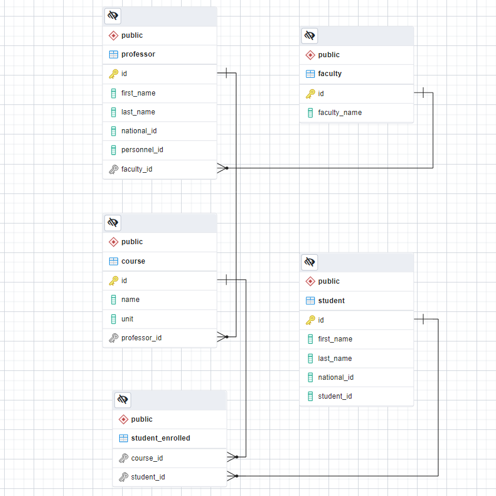

# School Management

## Description
A simple spring boot school management app to practice the basics of spring boot.
I did this project to practice the basics of spring boot.

## About the project
For a simple school management system we want the following requirements:
* Add Faculties, Professors, Students and Courses
* Enroll student to course
* Assign professor to course
* Add professor to faculty

So we create our Entities and Database using the following ERD:

<p align="center">

</p>

### Features
Some basic features of the app:
* Add and get courses
* Add, get, delete and update students
* Add and get professor
* Add and get faculties
* Get list of students of each professor
* Get list of students and professors of each faculty
* And more

## Getting started

### Requirements
For building and running the app you need `Java` `maven` and `Postgres` installed.

### API Endpoints
To add **Student** send POST request to: `localhost:8080/api/v1/student`
```bash
Sample Response:

{
    "id": 2,
    "studentId": 956,
    "firstName": "Alex",
    "lastName": "Smith",
    "nationalId": 482
}
```

To get list of **Students** send GET request to: `localhost:8080/api/v1/student`
```bash
Sample Response:

[
    {
        "id": 1,
        "studentId": 961,
        "firstName": "hasan",
        "lastName": "hasani",
        "nationalId": 459
    },
    {
        "id": 2,
        "studentId": 956,
        "firstName": "Alex",
        "lastName": "Smith",
        "nationalId": 482
    }
]
```

To delete a **Student** send DELETE request to: `localhost:8080/api/v1/student/[student id]`

To add **Professor** send POST request to: `localhost:8080/api/v1/professor`

To get list of **Professors** send GET request to: `localhost:8080/api/v1/professor`

To add **Course** send POST request to: `localhost:8080/api/v1/course`
```bash
Sample Response:

{
    "id": 1,
    "name": "data structure",
    "unit": 3,
    "enrolledStudents": null,
    "professor": null
}
```

To get list of **Courses** send GET request to: `localhost:8080/api/v1/course`

To add **Faculty** send POST request to: `localhost:8080/api/v1/faculty`
```bash
Sample Response:

{
    "id": 1,
    "name": "Computer",
    "professors": null
}
```
To get list of **Faculties** send GET request to: `localhost:8080/api/v1/faculty`

To Enroll a **Student** to a **Course** send PUT request to: `localhost:8080/api/v1/course/[course id]/student/[student id]`
```bash
Sample Response:

{
    "id": 1,
    "name": "data structure",
    "unit": 3,
    "enrolledStudents": [
        {
            "id": 1,
            "studentId": 961,
            "firstName": "hasan",
            "lastName": "hasani",
            "nationalId": 459
        }
    ],
    "professor": null
}
```

To assign a **Professor** to a **Course** send PUT request to: `localhost:8080/api/v1/course/[course id]/professor/[professor id]`
```bash
{
    "id": 1,
    "name": "data structure",
    "unit": 3,
    "enrolledStudents": [
        {
            "id": 1,
            "studentId": 961,
            "firstName": "hasan",
            "lastName": "hasani",
            "nationalId": 459
        }
    ],
    "professor": {
        "id": 1,
        "personnelId": 123,
        "firstName": "Jane",
        "lastName": "Doe",
        "nationalId": 456
    }
}
```

To add a **Professor** to a **Faculty** send PUT request to: `localhost:8080/api/v1/faculty/[faculty id]/professor/[professor id]`